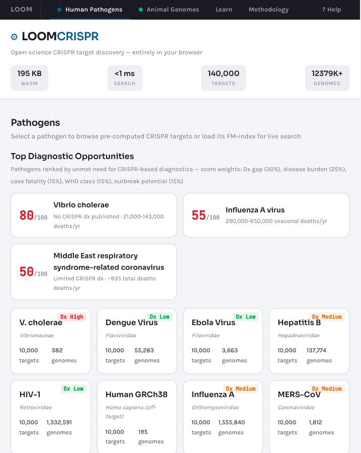

# LOOM — Open-Science CRISPR Target Discovery

A 195 KB WebAssembly search engine that scans 700,000+ pathogen genomes in sub-millisecond time, entirely in the browser. No backend, no install, no API key.

**[Try the live tool →](https://calm-mushroom-0185d800f.4.azurestaticapps.net/crispr-search.html)**



---

## What This Is

LOOM is a BWT/FM-index exact-retrieval engine built in Rust and compiled to WebAssembly. Its primary application is **open-science CRISPR diagnostic target discovery**: finding conserved 23-mer sequences across massive pathogen genome collections that could serve as diagnostic detection targets.

The project produced:

1. **A browser-based search tool** — select a pathogen, browse pre-computed targets, filter by gene/PAM/novelty, or run live FM-index search against the full genome collection
2. **52 novel CRISPR diagnostic targets** — in genes with no prior published CRISPR diagnostics, verified through a 4-strategy literature scan with ontology-backed synonym expansion
3. **A reproducible pipeline** — every result in the paper can be regenerated from the scripts and data in this repository

## Key Numbers

| Metric | Value |
|--------|-------|
| WASM binary size | 195 KB |
| Search latency | < 1 ms |
| Pathogen genomes indexed | 12.3M+ |
| Pre-computed targets | 140,000+ |
| Novel targets discovered | 52 |
| Off-target animal genomes screened | 7 (human, mouse, cow, pig, chicken, bat, camel) |

---

## Repository Structure

```
brenda/                 Rust FM-index crate (the core engine)
  src/indexer/          Index construction: BWT, suffix arrays, sharding
  src/search/           Query engine: exact match, federated search

src/                    CLI + WASM bindings
  main.rs              Command-line interface entry point
  wasm.rs              WebAssembly bindings for browser deployment
  dna/                 Genomic pipeline: CRISPR scanning, off-target, conservation
  cli/                 CLI subcommands

web/                    Browser search interface (deployed to Azure Static Web Apps)
  crispr-search.html   Main search page — pathogen targets database + live search
  crispr-animal.html   Animal genome off-target screening
  learn.html           Interactive CRISPR learning guide
  methodology.html     v4 scan methodology & integrity report
  data/                Pre-computed JSON datasets served to the browser

data/crispr_guides/     Research results & validation data
  novel_52_guides.tsv   The 52 novel diagnostic targets (primary result)
  offtargets_*.csv      Off-target screening against 7 animal genomes
  patent_scan_report.json   Prior art screening results

scripts/                Reproducibility pipeline
  overnight_openscience.sh  Full pipeline orchestrator
  scan_crispr_targets.py    Target scanning wrapper
  compute_*.py/sh           Scoring, conservation, cross-reactivity, RNAfold
  pubmed_scan_v3.py         4-strategy literature gap verification (PubMed + Europe PMC)
  patent_scan.py            Lens.org prior art screening
  verify-citations.py       Citation verification for the paper
  ontology/                 Ontology fetchers (NCBI taxonomy, Disease Ontology, MONDO)

publications/           Research papers
  papers/               Source markdown for the paper
  preprints/            Built PDFs

docs/
  runbooks/             Pipeline operation guides
  plans/                Research planning documents
  lessons/              Development lessons learned
```

## Getting Started

### Prerequisites

- Rust (stable, 2024 edition)
- `wasm-pack` (for WASM builds)
- Python 3.10+ with a virtual environment (for pipeline scripts)

### Build the CLI

```bash
cargo build --release
```

### Build the WASM module

```bash
wasm-pack build --target web --out-dir pkg --release
```

### Run the search tool locally

Open `web/crispr-search.html` in a browser, or serve the `web/` directory:

```bash
cd web && python -m http.server 8080
```

### Run the pipeline

See [docs/runbooks/overnight-openscience-pipeline.md](docs/runbooks/overnight-openscience-pipeline.md) for full pipeline instructions.

```bash
# Scan targets for a pathogen
cargo run --release -- crispr-scan --fasta /path/to/genomes.fasta --output targets.json

# Score and filter guides
python scripts/compute_guide_scores.py

# Run off-target screening
bash scripts/compute_cross_reactivity.sh
```

## CLI Commands

| Command | Description |
|---------|-------------|
| `index` | Build an FM-index from text or FASTA files |
| `search` | Exact-match search against an index |
| `batch-search` | Search multiple patterns in one pass |
| `crispr-scan` | Scan genomes for CRISPR-targetable 23-mers |
| `guide-conservation` | Compute conservation scores across genome sets |
| `shard-search` | Distributed search across sharded indexes |

## The Paper

The research paper describing the methodology and results is in [publications/papers/](publications/papers/):

- **Full paper:** [pangenomic-crispr-targets-merged.md](publications/papers/pangenomic-crispr-targets-merged.md)
- **5-page brief:** [pangenomic-crispr-targets-brief.md](publications/papers/pangenomic-crispr-targets-brief.md)

An annotated walkthrough of the results is available at the [live website](https://calm-mushroom-0185d800f.4.azurestaticapps.net/annotated-panpathogen.html).

## License

MIT — see [web/LICENSE](web/LICENSE)

## Author

**Alvaro Videla Godoy** — built with a Mac Studio and GitHub Copilot, evenings and weekends.
